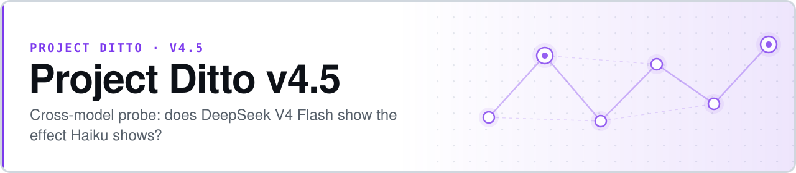

  <picture>
    <source media="(prefers-color-scheme: dark)" srcset="assets/banner-dark.svg">
    
  </picture>

# Project Ditto v4.5 — DeepSeek V4 Flash

**Every result in the program so far came from one model family. Does the effect survive a different one?**

v4.5 is the first cross-model probe in [Project Ditto](https://github.com/safiqsindha/Project-Ditto). [v4](https://github.com/safiqsindha/Project-Ditto-V4) established a strong real-vs-shuffled gap (+0.1311) on Pokémon Showdown chains using Claude Haiku 4.5. v4.5 asks the obvious follow-up: run the same frozen chains and the same scoring against **DeepSeek V4 Flash**, and see whether the effect is a property of the abstraction or a property of Claude.

> ### ⚠️ This repository is a scoping stub
>
> It currently contains only this README and a license. **No code, data, chains, or results are committed here.** The question below is the design intent; treat nothing in this repository as a reported finding until an experiment and its outputs land in it.
>
> The consolidated cross-version record for the program — including where each version's results actually live — is tracked in the program's findings inventory.

## The question

| | |
|---|---|
| **Held fixed** | v4's chain selection, the six-type abstraction, cutoff K, and the scoring layers |
| **Varied** | The evaluated model: Claude Haiku 4.5 → DeepSeek V4 Flash |
| **Measured** | Layer 1 real-vs-shuffled gap, under the same pre-registered tiers as v4 |

### Why it matters to the program

A cross-model null would mean the detectability gap is not a general property of constraint chains but an artifact of one model family's training or inference regime — which would reframe every prior version's result as model-conditional. A cross-model replication would do the opposite and strengthen the generality claim. Either way the answer is load-bearing, which is why later versions escalated the question to a full panel.

That escalation is [**v5.1**](https://github.com/safiqsindha/Ditto-5.1), which runs 22 models across 12 providers rather than one challenger, and [**v5.4 — OLAT**](https://github.com/safiqsindha/DITTO-V5.4-OLAT), which sweeps 24 inference levers on both DeepSeek V4 Flash and V4 Pro. If you are looking for the substantive cross-model evidence, start with those two.

## Pre-registered tiers (inherited from v4)

| Tier | Criterion |
|---|---|
| Strong-positive | Layer 1 gap ≥ 0.08 **and** Bonferroni *p* < 0.01 |
| Moderate-positive | Layer 1 gap ≥ 0.05 **and** Bonferroni *p* < 0.05 |
| Null | Gap not clearing 0.05, or *p* not clearing 0.05 |
| Reversed | Gap negative **and** Bonferroni *p* < 0.05 in the negative direction |

## If you are picking this up

To make the repository match its name, it needs: a `SPEC.md` fixing thresholds before any scoring, the v4 chain selection vendored or referenced by manifest hash, a runner targeting the DeepSeek API, and a scorer run in a separate blinded session. The program convention is that the pre-registration commit lands **before** the first evaluation call.

## The Ditto program

| Version | Domain | Headline |
|---|---|---|
| [v1](https://github.com/safiqsindha/Project-Ditto) | Pokémon Showdown telemetry | Sonnet +0.206 · Haiku +0.066 |
| [v2](https://github.com/safiqsindha/Project-Ditto-v2) | Programming agent trajectories | Partial reproduction |
| [v3](https://github.com/safiqsindha/Project-Ditto-V3) | Chess · Chess960 · checkers · draughts | Phase 1 complete, paused at Gate 8 |
| [v4](https://github.com/safiqsindha/Project-Ditto-V4) | Pokémon, as a methodology control | +0.131, strong-positive |
| **v4.5** ⟵ *you are here* | **DeepSeek V4 Flash cross-model probe** | **Scoping stub** |
| [v5](https://github.com/safiqsindha/Ditto-V5) | PUBG · NBA · CS:GO · Rocket League · poker | 4-tier hierarchy, closed |
| [v5.1](https://github.com/safiqsindha/Ditto-5.1) | 22-model cross-provider panel | Near-chance across the panel |
| [v5.2](https://github.com/safiqsindha/Ditto-5.2-diagostic) | Diagnostic kit for the v5.1 null | Pre-registered, in progress |
| [v5.4](https://github.com/safiqsindha/DITTO-V5.4-OLAT) | 24 inference levers, two DeepSeek models | 6 meaningful conditions |

## License

[MIT](LICENSE) — free to use, modify, and distribute.
